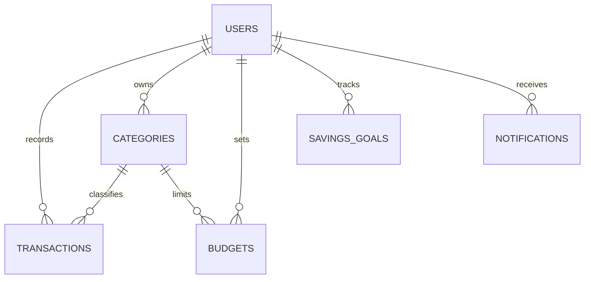

# Database Design Report: Smart Expense Tracker

## 1. Overview
The Smart Expense Tracker application relies on a robust relational database (`expense_db`) to store and manage user data, financial transactions, budgeting, savings goals, and notifications. The database primarily consists of **six core tables** and **one comprehensive view** used for quick aggregations.

The database is designed with data integrity in mind, utilizing strict foreign key constraints (with `ON DELETE CASCADE`), standard indexing for frequent queries, and appropriate enumeration types to restrict invalid data entries.

---

## 2. Entity-Relationship Summary
The core entity is the **User**. Every other financial data point revolves around the user.
- **Users (1)** to **Many** (Transactions, Categories, Budgets, Savings Goals, Notifications).
- This structure ensures that if a user account is deleted, all associated financial records are removed automatically to comply with data privacy standards and maintain database hygiene.

### Entity Relationship Diagram

---

## 3. Database Schema Details

### 3.1. `users` Table
Stores authentication details and user preferences.

| Column Name | Data Type | Constraints / Defaults | Description |
| :--- | :--- | :--- | :--- |
| `user_id` | INT | PRIMARY KEY, AUTO_INCREMENT | Unique identifier for each user |
| `username` | VARCHAR(50) | NOT NULL | Display name |
| `email` | VARCHAR(100) | NOT NULL, UNIQUE | Used for login, must be unique |
| `password_hash` | VARCHAR(255) | NOT NULL | Securely hashed password |
| `currency` | ENUM | DEFAULT 'INR' | ('USD', 'EUR', 'GBP', 'INR') |
| `notify_budget_alerts` | BOOLEAN | DEFAULT TRUE | Preference for budget notifications |
| `notify_goal_milestones`| BOOLEAN | DEFAULT TRUE | Preference for goals notification |
| `created_at`| TIMESTAMP | DEFAULT CURRENT_TIMESTAMP | Account creation timestamp |

### 3.2. `categories` Table
Stores custom and system-default categories for transactions. Allows distinguishing between income and expense sources.

| Column Name | Data Type | Constraints / Defaults | Description |
| :--- | :--- | :--- | :--- |
| `category_id` | INT | PRIMARY KEY, AUTO_INCREMENT | Unique category identifier |
| `user_id` | INT | FOREIGN KEY, NULLABLE | User owner. (NULL for defaults) |
| `name` | VARCHAR(50) | NOT NULL | Category name (e.g., 'Groceries') |
| `type` | ENUM | NOT NULL | Either 'income' or 'expense' |

> **Constraints & Indexes**:
> - `UNIQUE KEY uq_categories_user_name_type (user_id, name, type)` ensures a user cannot have duplicate categories of the same type.
> - Indexed by `(type, name)` for faster lookup.

### 3.3. `transactions` Table
Logs every financial activity recorded by the user.

| Column Name | Data Type | Constraints / Defaults | Description |
| :--- | :--- | :--- | :--- |
| `transaction_id` | INT | PRIMARY KEY, AUTO_INCREMENT | Unique transaction identifier |
| `user_id` | INT | FOREIGN KEY, NOT NULL | Associated user |
| `category` | VARCHAR(50) | NOT NULL | The category this transaction falls under |
| `amount` | DECIMAL(10,2) | NOT NULL | Value of the transaction |
| `type` | ENUM | NOT NULL | Either 'income' or 'expense' |
| `description` | VARCHAR(255) | NULL | Optional text note |
| `date` | DATE | NOT NULL | Transaction date |
| `method` | VARCHAR(50) | NULL | e.g., 'Cash', 'Card', 'Bank Transfer' |
| `created_at` | TIMESTAMP | DEFAULT CURRENT_TIMESTAMP | Timestamp of creation |

> **Indexes**:
> Heavily indexed to optimize filtering by `(user_id, date)`, `(user_id, type, date)`, and `(user_id, category, date)`.

### 3.4. `budgets` Table
Enforces monthly spending limits defined by the user for specific expense categories.

| Column Name | Data Type | Constraints / Defaults | Description |
| :--- | :--- | :--- | :--- |
| `budget_id` | INT | PRIMARY KEY, AUTO_INCREMENT | Unique budget identifier |
| `user_id` | INT | FOREIGN KEY, NOT NULL | Associated user |
| `category` | VARCHAR(50) | NOT NULL | Category the budget applies to |
| `amount` | DECIMAL(10,2) | NOT NULL | The maximum allowed limit |
| `month` | VARCHAR(7) | NOT NULL | Format: YYYY-MM |

> **Constraints**:
> - `UNIQUE KEY (user_id, category, month)` prevents multiple conflicting budgets for the same category in a single month.

### 3.5. `savings_goals` Table
Tracks long-term financial objectives and milestones.

| Column Name | Data Type | Constraints / Defaults | Description |
| :--- | :--- | :--- | :--- |
| `goal_id` | INT | PRIMARY KEY, AUTO_INCREMENT | Unique goal identifier |
| `user_id` | INT | FOREIGN KEY, NOT NULL | Associated user |
| `name` | VARCHAR(100) | NOT NULL | Name of the goal (e.g., 'New Car') |
| `target_amount` | DECIMAL(10,2) | NOT NULL | The financial target |
| `current_amount` | DECIMAL(10,2) | DEFAULT 0.00 | Amount saved so far |
| `color` | VARCHAR(20) | DEFAULT 'bg-blue-500' | UI identifier for frontend rendering |
| `icon` | VARCHAR(50) | DEFAULT 'fa-bullseye' | FontAwesome icon class |
| `priority` | ENUM | DEFAULT 'medium' | ('low', 'medium', 'high') |
| `deadline` | DATE | NULL | Target completion date |
| `created_at` | TIMESTAMP | DEFAULT CURRENT_TIMESTAMP | Record creation time |

### 3.6. `notifications` Table
Stores systemic alerts regarding user activity (like exceeding budgets or hitting saving milestones).

| Column Name | Data Type | Constraints / Defaults | Description |
| :--- | :--- | :--- | :--- |
| `notification_id` | INT | PRIMARY KEY, AUTO_INCREMENT | Unique alert identifier |
| `user_id` | INT | FOREIGN KEY, NOT NULL | Targeted user |
| `type` | ENUM | NOT NULL | 'budget_alert', 'goal_milestone', 'reminder', 'system_message' |
| `title` | VARCHAR(100) | NOT NULL | Alert summary |
| `message` | TEXT | NOT NULL | Alert detailed content |
| `is_read` | BOOLEAN | DEFAULT FALSE | Read receipt tracking |
| `action_url` | VARCHAR(255) | DEFAULT NULL | Optional redirect link |
| `created_at` | TIMESTAMP | DEFAULT CURRENT_TIMESTAMP | Notification creation time |

---

## 4. Derived Views

### `user_finance_summary` View
This view aggregates real-time metrics per user without requiring complex JOINs in standard application code. It computes:
- **`total_income_recorded`**: Sum of all 'income' transactions.
- **`total_expense`**: Sum of all 'expense' transactions, excluding the 'Savings' category.
- **`allocated_savings`**: Sum of current amounts in `savings_goals`.
- **`available_income`**: `total_income_recorded` - `allocated_savings`.
- **`available_balance`**: `available_income` - `total_expense`.

## 5. Security & integrity
- Passwords are emphatically stored as hashes (`password_hash`).
- Orphaned records are prevented via `ON DELETE CASCADE` applied to all child user constraints.
- Financial arithmetic relies on precise `DECIMAL(10, 2)` formatting to prevent floating-point anomalies common in monetary calculations.
