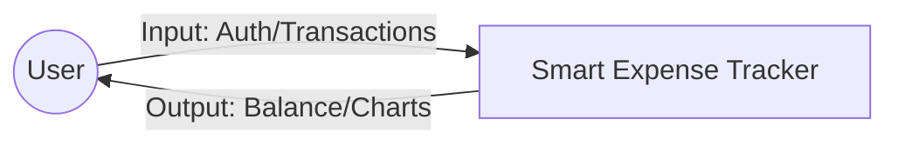
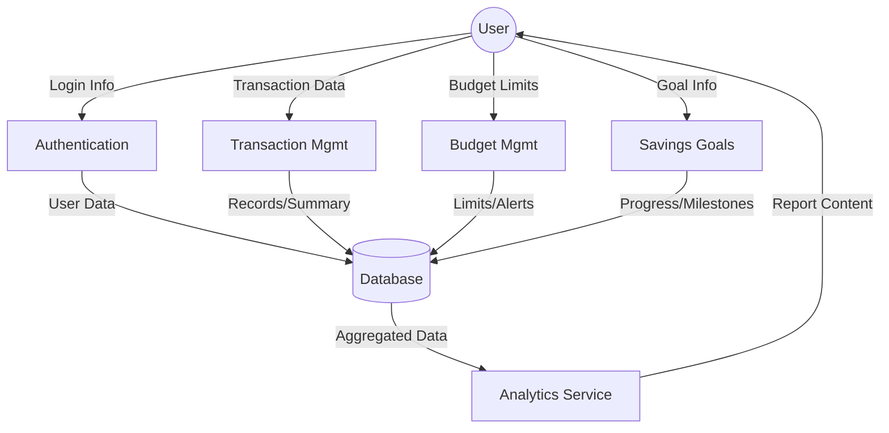
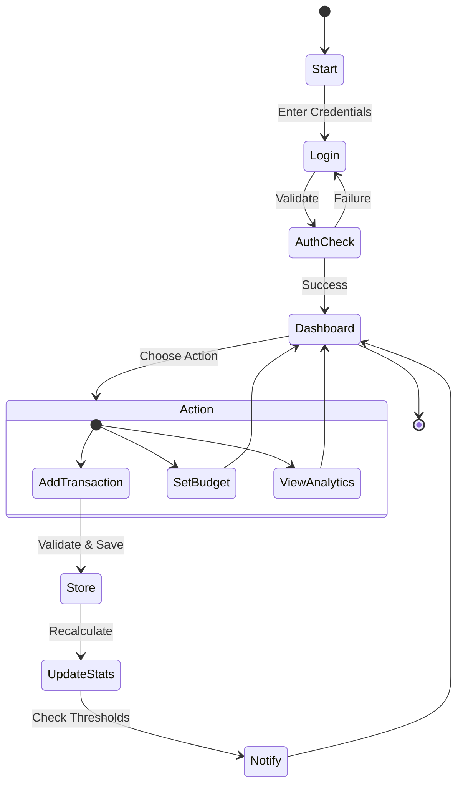
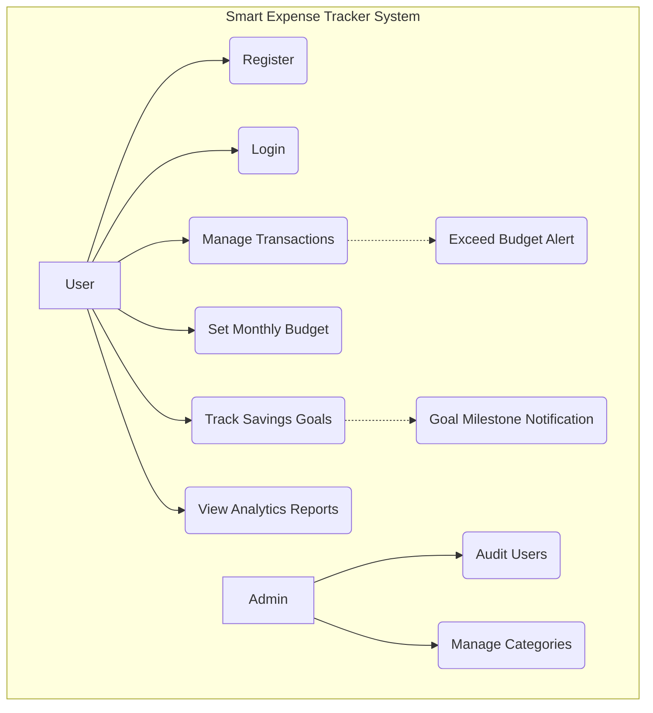
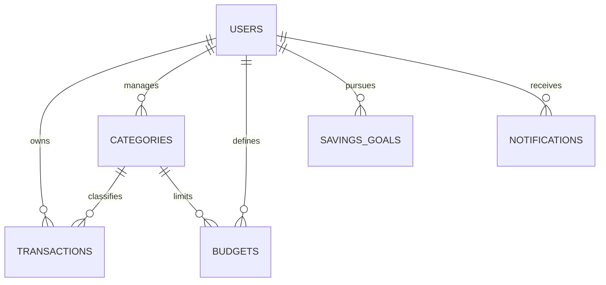

# SMART EXPENSE TRACKER - MINI PROJECT REPORT

---

**[Page 1]**

**A MINI PROJECT REPORT**

Submitted by

**SOURAV P** (Reg No: [Placeholder])

to

**APJ Abdul Kalam Technological University**

in partial fulfilment of the requirements for the award of Degree of

**Bachelor of Technology in Computer Science**

**Department of Computer Science Engineering**
**College of Engineering, Trikaripur**
**2024**

---

**[Page 2]**

**DECLARATION**

We undersigned hereby declare that the project report titled "Smart Expense Tracker" submitted for partial fulfillment of the requirements for the award of degree of Bachelor of Technology of the APJ Abdul Kalam Technological University, Kerala is a bonafide work carried out by us under the supervision of ________.

This report has not been submitted previously for any degree or diploma. This submission represents our ideas in our own words and where ideas or words of others have been included, we have adequately and accurately cited and referenced the original sources. we also declare that we have adhered to ethics of academic honesty and integrity and have not misrepresented or fabricated any data or idea or fact or source in our submission. We understand that any violation of the above will be a cause for disciplinary action by the institute and/or the University and can also evoke penal action from the sources which have thus not been properly cited or from whom proper permission has not been obtained. This report has not been previously formed the basis for the award of any degree, diploma or similar title of any other University.

---

**[Page 3]**

**DEPARTMENT OF COMPUTER SCIENCE ENGINEERING**
**COLLEGE OF ENGINEERING, TRIKARIPUR**

**CERTIFICATE**

This is to certify that the report entitled "SMART EXPENSE TRACKER", submitted by **Sourav P** to the APJ Abdul Kalam Technological University in partial fulfillment of the requirements for the award of the Degree of Bachelor of Technology in Computer Science is a bonafide record of the project carried out by him under my guidance and supervision. This report in any form has not been submitted to any other University or Institute for any purpose.

**Internal Supervisor(s)**

**External Supervisor(s)**

**PG Coordinator**

**Head of the Department**

---

**[Page 4]**

**ACKNOWLEDGEMENT**

We give honour and praise to the LORD who gave us wisdom and enabled us to complete this mini project successfully.

We would like to thank the Department of Computer Science Engineering, College of Engineering Trikaripur, for giving us the opportunity to present this project.

We would like to express our deep gratitude to our project guide for his/her timely suggestions and encouragement through the processes involved in the development of the project and report preparation.

Last, but not the least, we express our heartfelt thanks to our friends and parents for their support and encouragement during this endeavour.

---

**[Page 5]**

**ABSTRACT**

Smart Expense Tracker is a web-based financial management system designed to help users record income and expenses efficiently. The system allows users to categorize transactions, set budgets, monitor savings goals, and analyze spending patterns through reports and charts. It provides a secure login system, transaction tracking, notification support, and dashboard analytics, making personal financial management simple and effective.

The application empowers users with full control over their personal economy, leveraging a secure, database-driven architecture to transform raw financial data into actionable insights through a premium, responsive interface. By digitizing the traditional ledger system, it reduces manual effort, improves spending control, and helps users achieve financial discipline.

---

**[Page 6]**

**CONTENTS**

1. ABSTRACT 5
2. LIST OF FIGURES 7
3. ABBREVIATIONS 8
4. CHAPTER 1: INTRODUCTION 9
   1.1 BACKGROUND 9
   1.2 SCOPE 10
   1.3 OBJECTIVE 10
   1.4 PROPOSED SYSTEM 10
5. CHAPTER 2: SRS 11
   2.1 PRODUCT OVERVIEW 11
   2.2 PRODUCT FUNCTIONALITY 12
   2.3 DESIGN AND IMPLEMENTATION CONSTRAINTS 13
   2.4 HARDWARE REQUIREMENTS 13
   2.5 SOFTWARE REQUIREMENTS 14
   2.6 FUNCTIONAL REQUIREMENTS 14
6. CHAPTER 3: MATERIAL AND METHODS 15
   3.1 DESIGN PHASE 15
   3.2 DATA FLOW DIAGRAM 16
   3.3 ACTIVITY DIAGRAM 19
   3.4 USE CASE DIAGRAM 21
   3.5 DATABASE DESIGN 23
7. CHAPTER 4: IMPLEMENTATION 25
8. CHAPTER 5: RESULTS AND DISCUSSIONS 29
9. CHAPTER 6: CONCLUSION 30
10. BIBLIOGRAPHY 31

---

**[Page 7]**

**LIST OF FIGURES**

3.2 Data Flow Diagram. 16
3.3 Activity Diagram. 20
3.4 Use case Diagram. 22
3.5 Database Design. 24
4.1 Home Page (Dashboard). 26
4.2 Login Page. 26
4.3 Add Expense Modal. 27
4.4 Transaction Ledger. 27
4.5 Budget Settings. 28
4.6 Savings Goals. 28
4.7 Analytics & Charts. 29
4.8 Notification System. 29

---

**[Page 8]**

**ABBREVIATIONS**

1. HTML - HyperText Markup Language
2. CSS - Cascading Style Sheets
3. JavaScript - Programming Language
4. Python - Backend Programming Language
5. Flask - Web Framework
6. MySQL - Database Management System
7. API - Application Programming Interface

---

**[Page 9]**

**CHAPTER 1: INTRODUCTION**

Generating a digital footprint of one's financial activities is crucial in the modern era of rising costs and diverse spending patterns. The Smart Expense Tracker facilitates this by providing a comprehensive platform for recording daily financial activities. It enables users to monitor their wealth, set limits on spending, and plan for future goals seamlessly. The system includes multiple features for enhancing user experience and encouraging people to opt this method by leaving behind the conventional type of financial tracking.

**1.1 BACKGROUND**

Many users struggle to manually track daily expenses and savings. Traditional methods such as notebooks or spreadsheets are inefficient and error-prone. The existing manual system does not enable customers to easily understand their spending details, category-wise breakdowns, and their balance at intervals. During this manual system, it is difficult to update or create changes to any data quickly. As users do not have the ability to know what amount is available for specific categories, they are often ineffectual in making fast financial decisions, which can lead to overspending and financial stress. The time loss involved in manual auditing common in traditional methods can be drastically reduced by implementing this digital system.

**1.2 SCOPE**

The system helps students, families, and professionals monitor financial activities digitally. Enhancing the financial experience & ensuring financial wellbeing through disciplined choices are some of the tangible benefits. No-touch recording using the web app, real-time analytics, and flexible budget adjustments are key features. The scope includes personalized management with secured accounts, proactive budget alerts, and enterprise-grade data persistence.

**1.3 OBJECTIVE**

The main objective of the Smart Expense Tracker is to modernise the conventional financial management system and to make good use of digital tracking to reduce time taken in auditing and other delays. A simple database is maintained, allowing for faster execution and maintaining of records. The user interface is user-friendly and ensures that it takes very little time for the user to get used to the system. It will give the users a lot of clarity and will be effective for long-term savings.

**1.4 PROPOSED SYSTEM**

The Smart Expense Tracker will provide a very convenient way for users to track their finances. A unique account will be used for users accessing the application through which they will be able to see their available balance, recent transactions, and progress towards goals. Several methods for visualization will be available in the app, preferably charts which can be used to identify spending patterns. This application will also provide details regarding budget limits and other valuable information which is otherwise ignored. The aim is to reduce the stress of financial planning and address flaws in current manual methods.

---

**[Page 11]**

**CHAPTER 2: SOFTWARE REQUIREMENT SPECIFICATION (SRS)**

This chapter will discuss the product overview, product functionality, design and implementation constraints. It also discusses specific requirements i.e., software and hardware requirements.

**2.1 PRODUCT OVERVIEW**

The Smart Expense Tracker is a high-fidelity, web-based financial management system. It facilitates the seamless recording of daily income and expenses, granular categorization of transactions, monthly budget enforcement, and the pursuit of long-term savings goals. Users receive electronic updates on their financial status, making financial management simple and effective.

---

**[Page 12]**

**2.2 PRODUCT FUNCTIONALITY**

**User: Regular User**
Functions: A User can register and login to the application. They can browse through various transaction categories and add income or expenses. They can set monthly budgets for specific categories and track their progress through visual indicators. Users can also create savings goals and receive notifications when milestones are reached. The user can modify personal profile information such as password and currency preferences.

**User: Administrator**
Functions: The Administrator is the super user and has complete control over system-level activities. They can monitor user registrations and high-level system activity. The administrator also manages the list of default transaction categories and can audit transaction logs for system integrity.

---

**[Page 13]**

**2.3 DESIGN AND IMPLEMENTATION CONSTRAINTS**

In existing manual systems, there are no available options for real-time tracking of budgets or goal milestones. We propose a system for proper management of financial records which can be easily used and implemented without much technical prowess. The unavailability of such a system has caused unwanted overspending. Our idea of the expense tracker provides user-friendly features such as:
- Real-time balance updates
- Automated budget alerts
- Visual progress tracking for goals
- Categorized transaction ledger
- Minimal and premium UI

**2.4 HARDWARE REQUIREMENTS**

- Processor: 2 GHz minimum, multi-core processor
- Memory (RAM): At least 4GB, preferably higher.
- Hard disk space: 500MB
- Display: Optimal at 1920x1080 or higher

---

**[Page 14]**

**2.5 SOFTWARE REQUIREMENTS**

- Frontend: HTML5, Tailwind CSS, JavaScript (ES6+)
- Backend: Python (Flask Framework)
- Database: MySQL (transactional integrity)
- IDE: VS Code

**2.6 FUNCTIONAL REQUIREMENTS**

**USER:**
- Register: User has to register on the website to use the tracker.
- Login: User can login to the app to access their private data.
- View Details: User can view available balance, transactions, and reports.
- Manage Budgets: User can set and update category-specific limits.

**ADMIN:**
- Monitor Users: Oversee registrations and system health.
- Manage Categories: Configure default tags for system-wide use.
- View System Stats: Aggregate data for performance monitoring.

---

**[Page 15]**

**CHAPTER 3: MATERIALS AND METHODS**

Design process is the process through which designers design interfaces in software or electronic devices with an emphasis on aesthetics or style is termed user interface design. Here we use different design processes like data flow diagram, activity diagram, use case diagram to implement our project.

**3.1 DESIGN PHASE**

It is a visual representation of the system architecture. It shows the connections between the various components of the system and indicates what functions each component performs. The system follows a modified Model-View-Controller (MVC) architecture for maximum maintainability.

---

**[Page 16]**

**3.2 DATA FLOW DIAGRAM (DFD)**

The data flow diagram shown below illustrates the general structure of the system. It demonstrates how and what sorts of services the user chooses, as well as the amount of system engagement.

**Level 0 DFD (Context Diagram)**

**Level 1 DFD (Process Diagram)**

---

**[Page 19]**

**3.3 ACTIVITY DIAGRAM**

An activity diagram visually presents a series of actions or flow of control in a system similar to a flowchart or a data flow diagram. Activity diagrams are often used in business process modeling. They can also describe the steps in a use case diagram. Activities modeled can be sequential and concurrent. In both cases an activity diagram will have a beginning (an initial state) and an end (a final state). The workflows from the activity diagram will serve as guide for system navigation in the final design phase of the system.

---

**[Page 21]**

**3.4 USE CASE DIAGRAM**

It is a graphical depiction of a user's possible interactions with a system. A use case diagram shows various use cases and different types of users the system has and will often be accompanied by other types of diagrams as well. The use cases are represented by either circle or ellipses. The actors are often shown as stick figures. While a use case itself might drill into a lot of detail about every possibility, a use case diagram can help provide a higher level view of the system.

---

**[Page 23]**

**3.5 DATABASE DESIGN**

Database Design is a collection of processes that facilitate the designing, development, implementation and maintenance of enterprise data management systems. Properly designed databases are easy to maintain, improve data consistency and are cost effective in terms of disk storage space. The database designer decides how the data elements correlate and what data must be stored. The main objectives of database design in DBMS are to produce logical and physical designs models of the proposed database system.

The logical model concentrates on the data requirements and the data to be stored independent of physical considerations. It does not concern itself with how the data will be stored or where it will be stored physically. The physical data design model involves translating the logical DB design of the database onto physical media using hardware resources and software systems such as database management systems (DBMS).

The main objectives behind database designing are to produce physical and logical design models of the proposed database system. To elaborate this, the logical model is primarily concentrated on the requirements of data and the considerations must be made in terms of monolithic considerations and hence the stored physical data must be stored independent of the physical conditions. On the other hand, the physical database design model includes a translation of the logical design model of the database by keeping control of physical media using hardware resources and software systems such as Database Management System (DBMS).

Database design is a method of identifying the gaps and opportunities of designing a proper utilization method. It is the main component of a system that gives a blueprint of the data and its behavior inside the system. A proper database design is always kept on priority due to the user requirements being kept excessively high and following up with the constraint practices of designing a database might only stand as a chance to gain the requested efficiency.

**ER Diagram**

**Table Schema Summary**

- **Users**: user_id, username, email, password_hash, currency, CreatedAt.
- **Transactions**: transaction_id, user_id, category, amount, type, description, date, method.
- **Budgets**: budget_id, user_id, category, amount, month (YYYY-MM).
- **Savings Goals**: goal_id, user_id, name, target_amount, current_amount, priority, deadline.
- **Notifications**: notification_id, user_id, type, title, message, is_read, ActionUrl.

---

**[Page 25]**

**CHAPTER 4: IMPLEMENTATION**

Implementation is the stage in the project where the theoretical design is turned into a working system. The implementation phase constructs, installs and operates the new system. The most crucial stage in achieving a new successful system is that it will work efficiently and effectively. If the user wants to access the expense tracker system it is necessary to login successfully. After login, users can see the dashboard, add transactions, and view reports.

**4.1 UI SCREENSHOTS**

*Fig 4.1: Dashboard overview.*

*Fig 4.2: User login interface.*

*Fig 4.3: Interface for logging income and expenses.*

*Fig 4.5: Monthly budget configuration.*

*Fig 4.6: Milestone-based goal tracking.*

*Fig 4.7: Interactive charts and analytics.*

---

**[Page 31]**

**CHAPTER 5: RESULTS AND DISCUSSION**

The Smart Expense Tracker successfully records transactions, generates reports, and provides financial insights through charts and summaries. The application achieves its objective of reducing manual tracking effort and improving financial discipline. We were able to create user-friendly user-interface which can be used by the user efficiently. Regarding the backend of the project we were able to create tables for user, transactions, budgets, and goals which store relevant data securely. Register form is also created where the user can register for the system. The system improves financial awareness and simplifies expense management through its integrated modules.

---

**[Page 32]**

**CHAPTER 6: CONCLUSION**

The project provides a practical digital solution for financial management. It reduces manual effort, improves spending control, and helps users achieve financial discipline. The transition from manual ledgers to this automated digital ecosystem ensures data persistence, visual clarity, and proactive financial monitoring. With the help of this app we can reduce overspending as we can monitor the budget in real-time. It prevents users from forgetting their expenditures and ensures their financial records are accurate. Future enhancements could include automated bank statement parsing and predictive analytics for future spending trends.

---

**[Page 33]**

**BIBLIOGRAPHY**

1. **www.geeksforgeeks.org** - Reference for Data Flow Diagrams and System Design.
2. **www.python.org** - Python Documentation and best practices.
3. **www.mysql.com** - Relational database architecture.
4. **www.w3schools.com** - Frontend development tutorials.
5. **Flask Documentation** - Backend routing and session management.
6. **Chart.js Documentation** - Data visualization integration.
7. **Tailwind CSS Documentation** - Responsive UI components.

---
