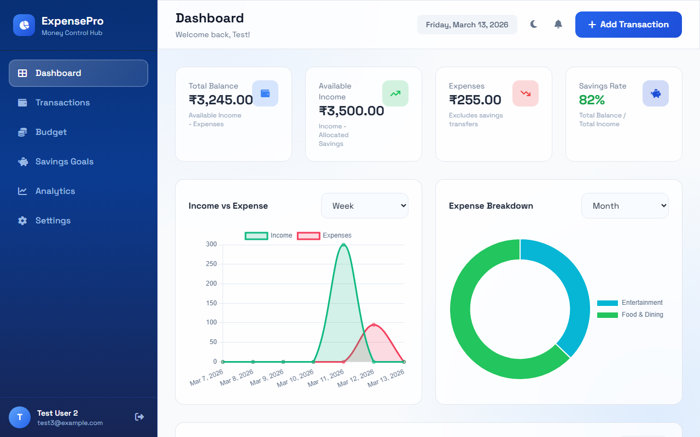
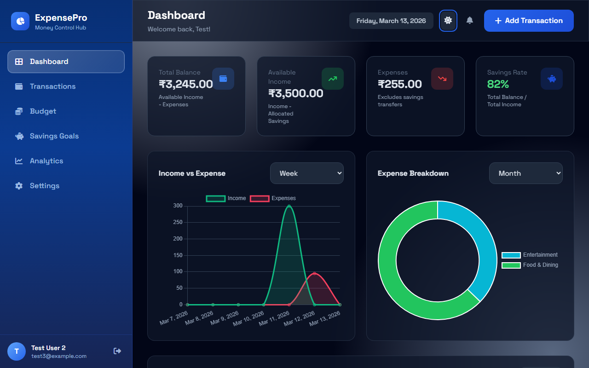
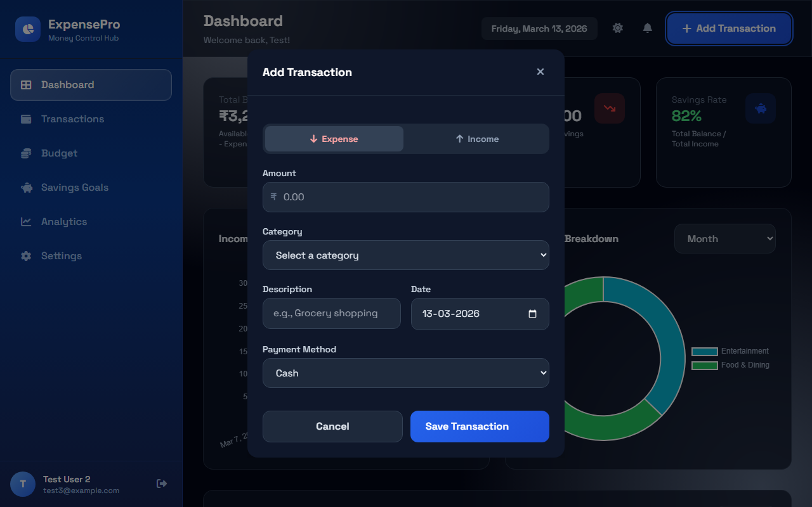
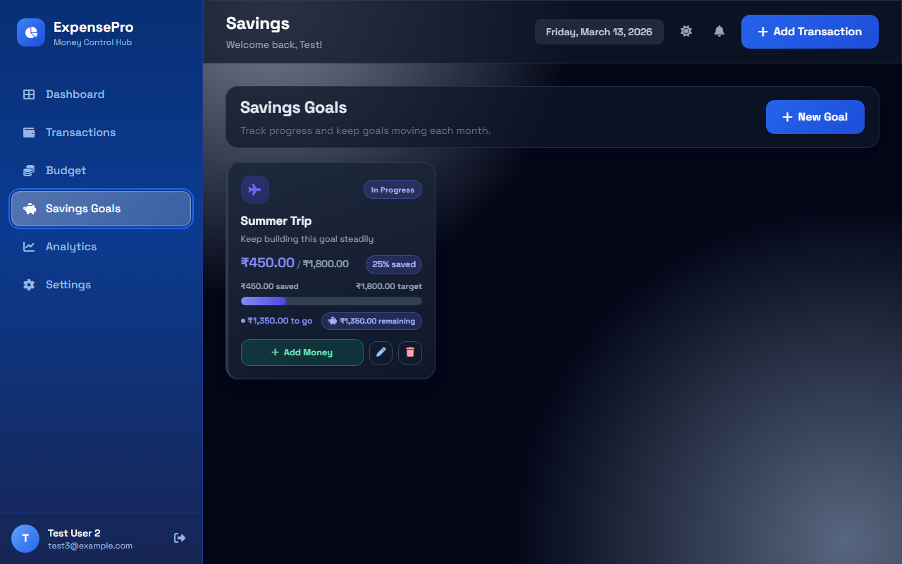

# Smart Expense Tracker - GUI Design Report

# Smart Expense Tracker - GUI Design Report

## 1. Executive Summary & Design Philosophy
The Smart Expense Tracker Graphical User Interface (GUI) is engineered to transform the often-stressful task of financial management into a visually engaging, intuitive, and highly responsive experience. 

The core design philosophy rests on three pillars:
1.  **Trust & Clarity:** Using structural predictability and a professional color palette to evoke security.
2.  **Cognitive Ease:** Minimizing visual clutter by utilizing ample whitespace (negative space) and progressively disclosing complex information (e.g., hiding forms inside modals).
3.  **Dynamic Engagement:** Utilizing micro-interactions, smooth CSS transitions, and "glassmorphic" elements to make the interface feel modern and alive, encouraging daily user interaction.

## 2. Technology Stack & Implementation Strategy
The UI is not a generic template, but a bespoke hybrid architecture:
*   **Foundation:** **Tailwind CSS** (via CDN) serves as the atomic utility framework. It provides the rigid spacing scales, typography baseline, and grid layout system.
*   **Custom Architecture:** A substantial custom stylesheet (`dashboard.css`) sits on top of Tailwind. This file defines complex CSS variables, bespoke animations (like toast timers), custom form focus rings, and intricate components (like the Savings Goal color picker) that utilities alone cannot achieve.
*   **JavaScript Layer:** Vanilla ES6 Modules handle interactivity cleanly without the overhead of a heavy frontend framework like React or Vue, ensuring lightning-fast load times.
*   **Data Visualization:** **Chart.js** provides the robust, interactive canvas-based rendering for financial charts.

## 3. Typography
Typography is a critical component of data-heavy applications. The project uses **Space Grotesk** (via Google Fonts) as the exclusive font family.
*   **Why Space Grotesk?** It is a sans-serif typeface that blends geometric precision with subtle, quirky details. It renders numbers (crucial for a finance app) exceptionally well, offering clear legibility down to very small sizes (`text-xs`), while maintaining a tech-forward, modern aesthetic in large headers (`text-2xl`).
*   **Hierarchy:** Font weights are strictly controlled. `font-bold` (700) is reserved for page titles and critical data points (like total balances). `font-medium` (500) is used for labels and secondary data, while `font-normal` (400) handles body text.

## 4. Color Palette & Psychological Impact
The application uses a highly semantic and psychologically tuned color system, heavily reliant on CSS variables for seamless theme switching.

*   **Primary Palette (The Trust Layer):**
    *   Built on Tailwind’s Blue spectrum (`blue-50` to `blue-950`).
    *   Blue is universally associated with stability, corporate security, and calm—essential traits for an expense tracker.
    *   The sidebar uses deep navy (`bg-blue-950`) to anchor the application visually.

*   **Semantic Palette (The Action Layer):**
    *   **Income (Success):** Green (`text-green-600`, `bg-green-100`) denotes positive flow.
    *   **Expense (Warning/Alert):** Red (`text-red-600`, `bg-red-100`) denotes outward flow or destructive actions.
    *   These colors are muted slightly in dark mode (`text-green-400`, `text-red-400`) to prevent eye strain against dark backgrounds.

*   **Savings Goals Palette (The Motivation Layer):**
    To make saving money feel rewarding, the goal creation module features a vibrant, selectable palette allowing users to color-code their goals:
    *   *Ocean Blue (`bg-blue-500`)*
    *   *Forest Teal (`bg-teal-600`)*
    *   *Royal Violet (`bg-violet-600`)*
    *   *Rose Red (`bg-rose-600`)*
    *   *Amber Gold (`bg-amber-700`)*

## 5. System Architecture: Dark Mode
Dark mode is treated as a first-class citizen, not an afterthought. 
*   **Implementation:** It utilizes a `class`-based strategy via Tailwind (`dark:` modifiers) combined with remapped CSS variables (`--bg-base`, `--surface`, `--text-primary`).
*   **Prevention of Flash:** An inline synchronous script in the `<head>` checks `localStorage` and applies the `.dark` class *before* the DOM renders, completely eliminating the "white flash" on page load.
*   **Contrast Philosophy:** Instead of pure black (`#000000`), Dark Mode uses deep slate (`slate-950` / `#020617`). This drastically reduces the halation effect (astigmatism blur) and is much easier on the eyes during prolonged use.

## 6. Structural Layout & Grid
The application utilizes an industry-standard dashboard layout designed to maximize the workspace.

*   **The Sidebar (`aside#appSidebar`):**
    *   Fixed width on desktop (`w-72`), providing persistent access to core modules: Dashboard, Transactions, Budget, Savings Goals, and Analytics.
    *   On mobile devices (`lg:hidden`), the sidebar converts into an off-canvas drawer that slides in over a backdrop (`#sidebarBackdrop`), ensuring the data tables utilize 100% of the screen width on small devices.
*   **The Main Surface:**
    *   Uses a flexbox column layout. The top header provides contextual actions (theme toggle, notifications, "Add" button), while the scrollable area holds the primary content.

## 7. Deep Dive: Key Interactive Components

### 7.1 The Modals (Focus & Data Entry)
Instead of navigating users away to separate pages for data entry, modals (`modal-overlay` & `modal-container`) are used to maintain user context.

*   **Glassmorphism:** The modals sit on top of a subtle backdrop blur (`backdrop-filter: blur(4px)`), drawing the user's absolute focus to the task at hand.
*   **The "Professional Edition" Goal Modal:** The Savings Goal creation modal represents the peak of the UI's design. It features a custom gradient header, icon integration, and a bespoke color picker.
*   **Quick Suggestion Chips:** To drastically speed up UX, the Goal Modal includes interactive "chips" (e.g., '✈️ Travel', '🎓 Education'). Clicking a chip automatically populates the form field, minimizing keyboard input.

### 7.2 Toast Notification System
Feedback is crucial in a GUI. The app features a custom, bottom-right notification stack.
*   **Categorization:** Toasts are visually distinct based on state (Success, Error, Info).
*   **The Progress Timer:** Each toast features a highly modern CSS animation (`toast-timer`)—a thin bar that sweeps across the bottom of the notification over 3-5 seconds, visually indicating exactly when the message will auto-dismiss.

### 7.3 Form Inputs and States
Forms are designed to be frictionless.
*   **Unified Styling:** All inputs share a `.form-input` class ensuring consistent padding, border radii, and background colors.
*   **Focus States:** When an input receives focus, it highlights with a bold primary-colored ring (`ring-blue-500`). This is critical for accessibility (a11y) and keyboard navigation.

### 7.4 Buttons and Micro-interactions
Transitions are applied universally to interactive elements (`transition-all duration-200`).
*   **Primary Buttons:** (`.btn-primary`) utilize subtle linear gradients, slight drop shadows, and a hover transform (`translateY(-1px)`) to feel tactile, imitating a physical button press.
*   **Secondary Buttons:** (`.btn-secondary`) rely on subtle background color shifts (`bg-slate-100` to `bg-slate-200`) to indicate interactivity without competing with primary calls to action.

## 8. Conclusion
The Smart Expense Tracker's GUI goes far beyond a basic template approach. By meticulously combining utility styling (Tailwind) with highly customized CSS architecture, the application delivers a premium, robust, and psychologically comforting user experience that rivals commercial financial software.
