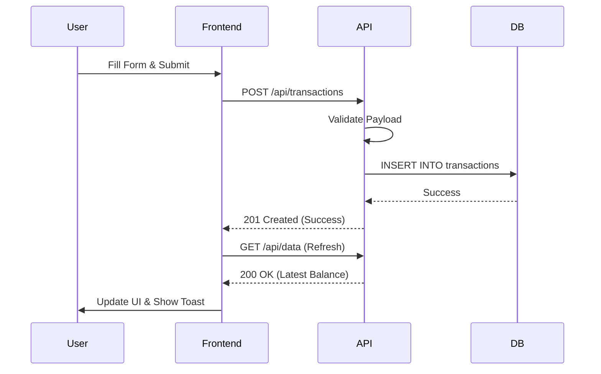

# Smart Expense Tracker - API Report

This document outlines the RESTful API endpoints available in the Smart Expense Tracker application. The APIs are protected and require user authentication (managed via `flask_login`).

## 1. Dashboard & Core Data
The dashboard aggregates the primary financial data for the user.

- **`GET /api/data`**
  Fetches the complete dashboard payload, including recent transactions, balance, and goal updates.
- **`POST /api/data/reset`**
  Clears all user financial data (transactions, goals, budgets) from the account.

### Dashboard View

*Figure 1.1: The main dashboard populated with data from the `/api/data` endpoint.*

### Typical Data Flow (Transaction Creation)

---

## 2. Transactions API
Endpoints for managing financial transactions (income and expenses).

- **`GET /api/transactions`**
  Lists transactions for the user.
  - **Query Parameters**:
    - `q`: Search string for description or category.
    - `limit`: Number of records (default: 1000, max: 2000).
  - **Response**: `{"transactions": [...]}`
- **`POST /api/transactions`**
  Creates a new transaction.
  - **Payload**: `{type, amount, category, date (YYYY-MM-DD), method, description}`
  - **Validation**: Amount must be > 0 and within DECIMAL(10,2) limits. Category length max 50.
- **`PUT /api/transactions/<id>`**
  Updates an existing transaction. (Note: System-generated goal funding transactions are read-only).
- **`DELETE /api/transactions/<id>`**
  Deletes a transaction. (Note: System-generated goal funding transactions cannot be deleted).

### Adding a Transaction

*Figure 2.1: The Add Transaction modal, which submits data to `/api/transactions` via POST.*

---

## 3. Savings Goals API
Endpoints to track and manage user savings goals.

- **`POST /api/goals`**
  Creates a new savings goal.
  - **Payload**: `{name, target, current, deadline (YYYY-MM-DD), color}`
  - **Validation**: Current amount cannot exceed target. Color must be from the allowed Tailwind palette.
- **`PUT /api/goals/<id>`**
  Updates a specific savings goal.
- **`DELETE /api/goals/<id>`**
  Removes a savings goal.

### Savings Goals Integration

*Figure 3.1: The Savings goals interface powered by the Goals API.*

*Figure 3.2: The Add Goal modal, submitting data to `/api/goals`.*

---

## 4. Budgets API
Endpoints designed for creating and managing spending limits.

- **`POST /api/budgets`** (or `/api/budget`)
  Upserts a budget for a category and month.
  - **Payload**: `{category, amount, month (YYYY-MM)}`
- **`DELETE /api/budgets/<id>`**
  Deletes a specific budget entry.

---

## 5. Notifications API
Manages system-generated notifications for the user (e.g., milestone alerts, budget warnings).

- **`GET /api/notifications`**
  Retrieves a list of all unread notifications.
- **`POST /api/notifications/read/<id>`**
  Marks a single specified notification as read.
- **`POST /api/notifications/read-all`**
  Marks all of the user's current notifications as read.

---

## 6. Settings API
Manages user application preferences.

- **`POST /api/settings`**
  Updates user settings. Accommodates configuration for app currency (`currency`) and granular notification preferences (`notify_budget_alerts`, `notify_goal_milestones`).

### Settings Application (Dark Mode)

*Figure 6.1: An example of the UI adapting to user preferences such as Dark Mode.*

---

## 7. System Health API
Diagnostic tool for checking application vitality.

- **`GET /api/health`**
  Returns the status of the API and Database connection. Expected response includes `{'api': True, 'db': True}`.

---

*End of Document*
