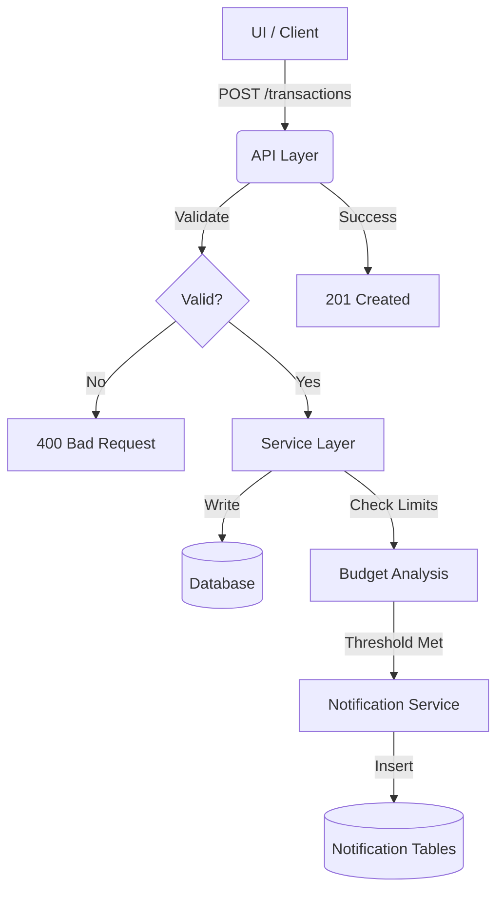

# API Workflow Report - Smart Expense Tracker

This report details the operational workflows within the Smart Expense Tracker, focusing on how API endpoints interact with the service layer and database to execute business logic.

## 1. Transaction Lifecycle & Notifications

When a user records an expense via the API, a multi-step workflow is triggered to ensure data integrity and user awareness.

### Workflow: Adding an Expense
1.  **Request**: `POST /api/transactions` with payload `{type: 'expense', amount: 50, ...}`.
2.  **Validation**: `validate_transaction_payload` ensures the amount is positive and the date is valid.
3.  **Persistence**: `transaction_service.add_transaction` inserts the record into the `transactions` table.
4.  **Budget Check**: 
    - The system identifies the budget for the specified category and month (`YYYY-MM`).
    - It calculates the total spent in that category for the month.
5.  **Notification Trigger**:
    - If expenses reach **80%** of the budget: A "Budget Warning" notification is created via `NotificationService`.
    - If expenses **reach or exceed 100%**: A "Budget Reached" notification is created.
6.  **Response**: `201 Created` with the transaction ID.

---

## 2. Savings Goal Management

The Goals API manages long-term savings, which includes automated audit trails.

### Workflow: Achieving a Goal
1.  **Request**: `PUT /api/goals/<id>` to update `current` amount.
2.  **Logic**: `goal_service.update_goal` calculates the progress.
3.  **Milestone Notifications**:
    - The system checks for "Milestone Highlights" (e.g., reaching 50%, 75%, or 100% of the target).
    - If a milestone is hit, a "Goal Milestone" notification is generated to congratulate the user.
4.  **Completion**: When `current >= target`, the goal is visually marked as completed in the UI (driven by the `/api/data` payload).

---

## 3. Data Integrity & Invariants

The API enforces strict rules to prevent logical inconsistencies in financial data.

### Workflow: Handling Account Reset
1.  **Request**: `POST /api/data/reset`.
2.  **Coordination**: `finance_service.clear_user_financial_data` orchestrates the deletion.
3.  **Sequential Deletion**:
    - Deletes `transactions` -> Deletes `budgets` -> Deletes `savings_goals`.
    - This ensures that no orphaned goal audit transactions remain (as they are tied to goal IDs).
4.  **Sync**: Resets the internal session/user state to reflect a clean slate.

---

## 4. User Configuration Flow

Preferences set via the API immediately influence system behavior.

### Workflow: Updating Notifications
1.  **Request**: `POST /api/settings` with `{notify_budget_alerts: false}`.
2.  **Update**: `settings_service.update_settings` persists the choice.
3.  **Immediate Effect**: Subsequent calls to `add_transaction` will skip the `_check_budget_and_notify` logic for that user because the user object is kept in sync via `flask-login`.

---

## Summary Diagram: Core Integration

