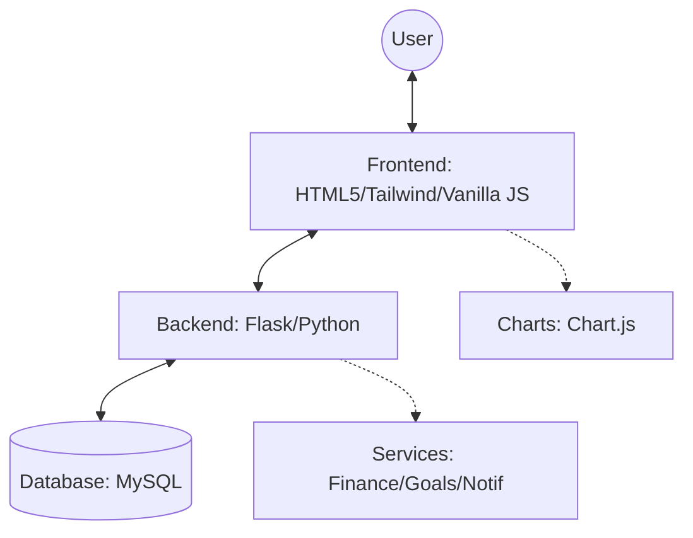

# Technology Stack Report for Smart Expense Tracker

## 1. Executive Summary

This document provides a comprehensive overview of the technologies, libraries, and frameworks utilized in the **Smart Expense Tracker** project. The application is built as a monolithic, server-side rendered web application with a robust **Python/Flask** backend, a **MySQL** relational database, and a dynamic, responsive frontend featuring **Tailwind CSS**, **Vanilla JavaScript**, and interactive charts via **Chart.js**.

---

## 2. Backend Architecture

The backend is engineered using **Python 3** and the **Flask** microframework. This provides a lightweight yet powerful foundation for routing, request handling, and server-side logic while allowing the seamless integration of specialized libraries for authentication and database connectivity.

### Core Framework and Tools
*   **Flask (v3.x or later compatible):** Serves as the primary web application framework. It manages HTTP requests, sessions, and multi-page routing, rendering templates via Jinja2 engine.
*   **Flask-Login:** Utilized for comprehensive session management, handling user authentication states (logging in, logging out, restricting access to protected routes).
*   **Flask-Bcrypt:** Provides cryptographic password hashing. It ensures that user credentials are securely salted, hashed, and verified against dictionary and brute-force attacks.
*   **python-dotenv:** Manages configuration securely. It loads environment variables from a `.env` file into the application's environment, keeping secrets (like `SECRET_KEY` and database credentials) out of the source code.
*   **Notification Service:** A dedicated backend service layer for managing system-generated alerts (milestones, budget warnings, reminders). It handles persistence and state tracking for user notifications.

---

## 3. Database Layer

The application utilizes a relational database architecture to guarantee data integrity, reliable transactions, and structured querying capabilities.

*   **MySQL:** The core relational database management system (RDBMS). Chose for its performance, reliability, and robust support for relational data structures essential to user and transaction management.
*   **mysql-connector-python:** The official Oracle-supported database driver. This pure Python driver facilitates the connection between the Flask backend and the MySQL server.
*   **Data Handling (DictCursor):** Configured to use a `DictCursor`, which returns database rows as Python dictionaries instead of tuples. This streamlines data manipulation on the backend and seamlessly maps to JSON when necessary.

---

## 4. Frontend Architecture

The frontend is designed to be highly interactive, responsive, and visually modern, using a blend of server-rendered templates and client-side dynamic behavior without the overhead of heavy Single Page Application (SPA) frameworks like React or Angular.

### UI and Styling
*   **HTML5 / Jinja2:** The structural foundation of the pages. Flask's Jinja2 template engine allows for template inheritance (e.g., `base.html`), dynamic content injection, and modular UI components.
*   **Tailwind CSS (via CDN):** Used as the primary CSS framework. It provides utility-first styling for rapid UI development, fully responsive grid systems, and a built-in customizable **Dark Mode** feature managed by client-side classes.
*   **Google Fonts (Space Grotesk):** Provides the modern, clean typography standard across the user interface.
*   **Font Awesome (v6.4.0):** Integrated for comprehensive vector iconography across the dashboard, sidebar, and modals.

### Client-Side Logic & Interactivity
*   **Vanilla JavaScript (ES6 Modules):** Manages dynamic frontend interactions such as modal toggling, sidebar navigation, form validation, theming, and asynchronous UI updates without full page reloads. Using native ES6 (`type="module"`) allows for clean separation of concerns.
*   **Chart.js:** An HTML5 canvas-based JavaScript charting library. It powers the "Analytics" and "Dashboard" views to provide rich, animated programmatic data visualizations (e.g., spending patterns, income vs. expense graphs).

### Architecture Visualization

---

## 5. Testing & Quality Assurance

Robust testing infrastructure ensures application stability against regressions when new features are integrated.

*   **pytest:** A mature, full-featured Python testing tool used as the primary testing framework. Based on the `pytest.ini` and `tests/` structure, it facilitates automated unit tests, API tests (`test_api.py`), and integration tests (`test_crud_workflow.py`).

---

## 6. Development Workflow and Tooling

*   **Pip / Requirements.txt:** Python dependency management defining all third-party libraries needed to run the ecosystem.
*   **Environment Configuration (`config.py`):** Centralizes the retrieval of variables (from system environment or `.env`), establishing a scalable, object-oriented configuration pattern for `SECRET_KEY`, `MYSQL_HOST`, `MYSQL_USER`, `MYSQL_PASSWORD`, and initial seeding options.

---

## 7. Key Architectural Decisions

1.  **Monolithic Design:** By rendering templates on the server and using standard form submissions and select JS overlays, the project emphasizes straightforward, secure data flow over complex client-server API sync states.
2.  **Utility-First CSS + Custom Overrides:** The adoption of Tailwind CSS eliminates the need for maintaining sprawling custom CSS files. Specific high-fidelity components (like the "Goal Modal") utilize a focused `dashboard.css` for complex glassmorphic effects and animations.
3.  **Modular Vanilla Scripting:** Eschewing heavy JS frameworks in favor of modular vanilla JavaScript keeps the payload minimal, loading times hyper-fast, and minimizes external dependencies.
4.  **Service-Oriented Backend:** The backend logic is decoupled into specialized services (Finance, Goal, Notification, Dashboard), ensuring maintainability and clear separation of concerns.
